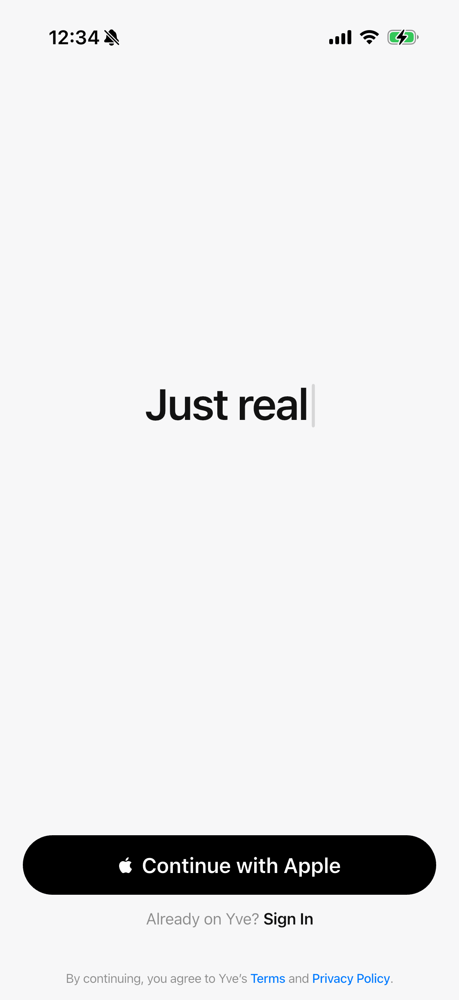
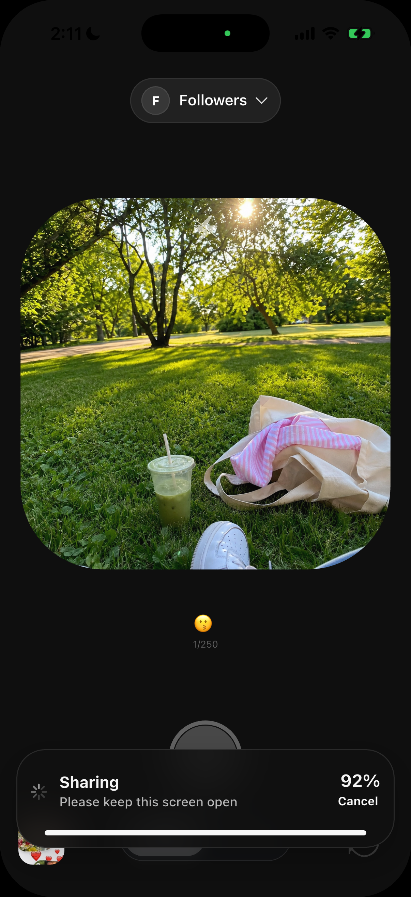
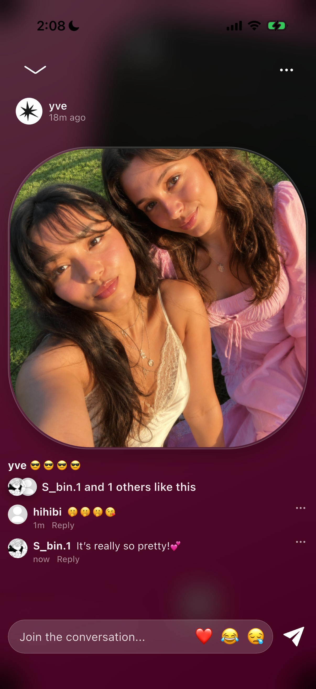
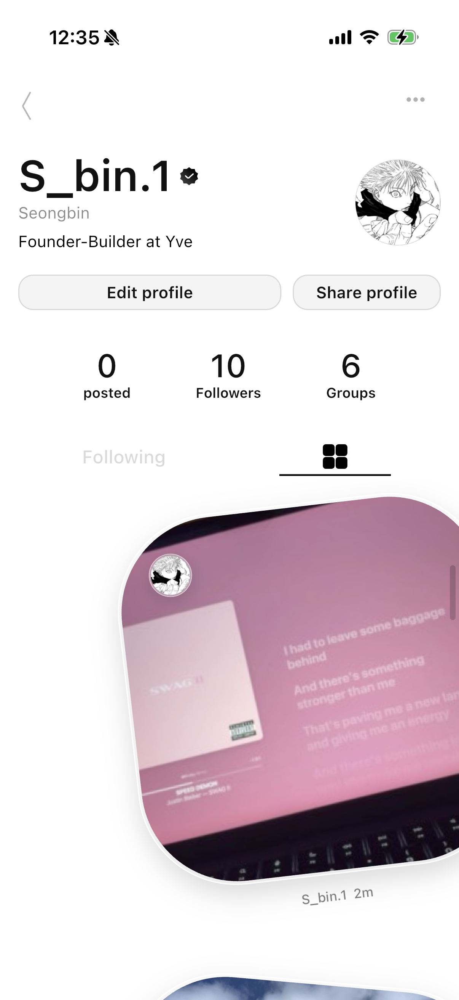
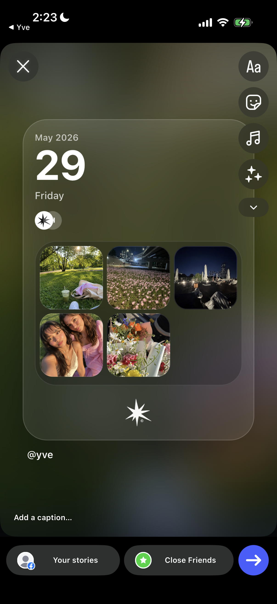
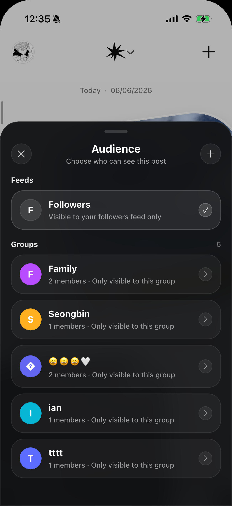

# Yve

Yve is a photo-centered social app built to make sharing feel lighter, faster, and more true to yourself.  
This is the first product that I, a 16-year-old high school student, independently planned, developed, and released on the App Store.

Yve focuses on helping people share everyday moments with close friends through casual photos and videos.  
I started building Yve in September 2025 while balancing school and development, and released it on the App Store in January 2026.

I worked across the entire product process, including planning, product design, UI/UX design, branding, Flutter development, Firebase-based backend structure, deployment, and early marketing.

---

## Overview

Many social media platforms today feel overly polished, public, and performance-driven.

Sometimes, there are small moments that feel too casual for Instagram Stories, but still meaningful enough to share with someone.  
Yve started from that simple feeling.

I wanted to create a space where people could share ordinary moments more comfortably, without the pressure of posting for a large audience.

> A social experience lighter than Stories, faster than messaging, and closer to real everyday sharing.

Yve is not an app for showing a perfect version of yourself.  
It is an app for sharing small, honest moments with people who truly matter.

---

## Background

Before Yve, I worked on two unfinished projects.

The first was Spot, a student community app I started with a friend in late 2024.  
The second was Aye, a simple communication app I started as my first solo project in early 2025.

Both projects were eventually discontinued, but they helped me learn how difficult it is to turn an idea into a real product.

Yve began as an idea that came out while I was working on Aye.  
Unlike my previous projects, Yve became the first product I actually completed, released, and continued improving after launch.

---

## Product Direction

Yve was designed around one simple idea:

> Sharing should feel natural, fast, and personal.

Instead of building a social app around public performance or endless feed consumption, I focused on creating a closer and lighter sharing experience.

The core direction of Yve includes:

- Sharing small everyday photos and videos with close friends
- Reducing the pressure of posting
- Helping users view and react to friends’ moments quickly and naturally
- Creating a more personal experience than public social media
- Encouraging lightweight communication through visual interaction

---

## Core Features

- Photo and video sharing
- Camera-first posting flow
- Friend-based social feed
- Timeline-style feed experience
- 24-hour visibility and archive-based structure
- Emoji-based reactions
- Likes, comments, and activity screen
- Sketch replies for more personal interaction
- User profiles and archives
- Calendar feature
- Group feature
- Friend invitation and sharing flow
- Instagram Stories sharing
- Apple Sign In
- Push notifications
- Onboarding and tutorial flow

---

## Key UX Concept: Timeline

One of Yve’s key UX concepts is the Timeline.

The Timeline is not a traditional sorted feed.  
It is designed to feel more like a DM-style feed, where friends’ moments and reactions naturally build up over time.

Instead of scrolling through a heavy social feed, users can check moments from close friends more quickly and lightly.

The goal was to make consuming posts feel:

- Faster
- Lighter
- More casual
- Less like browsing a heavy social media feed

This interaction came from the belief that everyday sharing should feel more effortless and less pressured.

---

## My Role

I independently planned and built Yve.

My role included:

- Product planning
- UI/UX design
- App flow design
- Branding
- Flutter development
- Firebase integration
- Push notification setup
- App Store release preparation
- Testing and iteration
- Short-form marketing
- AI-assisted development workflow

I worked across the overall product process, from planning, design, branding, development, backend setup, deployment, to early marketing.

I would not describe myself as a traditional developer yet.  
My strengths are closer to product planning, UI/UX design, service thinking, and using AI tools to turn ideas into working products quickly.

Through Yve, I learned how product planning, design, engineering, and user experience connect inside a real mobile product.

---

## Tech Stack

- Flutter
- Dart
- Firebase Auth
- Cloud Firestore
- Firebase Storage
- Firebase Cloud Messaging
- Cloud Functions
- Apple Sign In
- GitHub
- Figma
- AI-assisted development tools

---

## Challenges

Building Yve alone was not easy.

I had to learn and solve many parts of the product myself, including:

- Database structure
- Product planning and system design
- Authentication
- Push notifications
- App Store release process
- UI/UX design
- Product positioning
- User onboarding
- Performance issues
- Social interaction design

Push notifications were one of the most difficult parts of the process.  
There were many moments where I could not understand why something was not working, but debugging those issues helped me grow a lot.

---

## What I Learned

Building Yve taught me that making a real product is not just about implementing features.

I learned how difficult it is to make an app feel immediately understandable, useful, and natural to users.  
I also learned the importance of onboarding, friend invitation, product positioning, performance, and small UI details.

Through this project, I developed a stronger understanding of:

- Product thinking
- UI/UX design
- Mobile app development
- Social app mechanics
- Firebase-based backend structure
- AI-assisted development
- App Store release process
- Real user feedback and iteration

Yve helped me realize that I am especially interested in product, design, consumer social apps, and the process of turning early ideas into real services.

---

## Current Focus

Yve has been built and released as a real mobile app.

I am currently improving:

- Product positioning
- Onboarding experience
- Friend invitation flow
- Sharing motivation
- Main feed experience
- Overall clarity for first-time users
- Short-form marketing through Instagram, TikTok, and YouTube

---

## Screenshots

  
  
  

  
  
  

---

## Demo

- Main Timeline Demo: https://youtube.com/shorts/Foc1qrmr-Z4?si=NOjR580ZN4y7LJoV
- Camera Upload Demo: https://youtube.com/shorts/N7Tldes7kw8?si=5llrdpWe4_hK-qul

---

## Links

- App Store: https://apps.apple.com/us/app/yve/id6758312713
- Main Timeline Demo: https://youtube.com/shorts/Foc1qrmr-Z4?si=NOjR580ZN4y7LJoV
- Camera Upload Demo: https://youtube.com/shorts/N7Tldes7kw8?si=5llrdpWe4_hK-qul
- LinkedIn Post: Coming soon

---

## Contact

If you are interested in Yve or would like to know more about me, feel free to reach out.  
I would be happy to talk about the service, the development process, or how I have been building this product.

Email: seongbin.dev16@gmail.com
